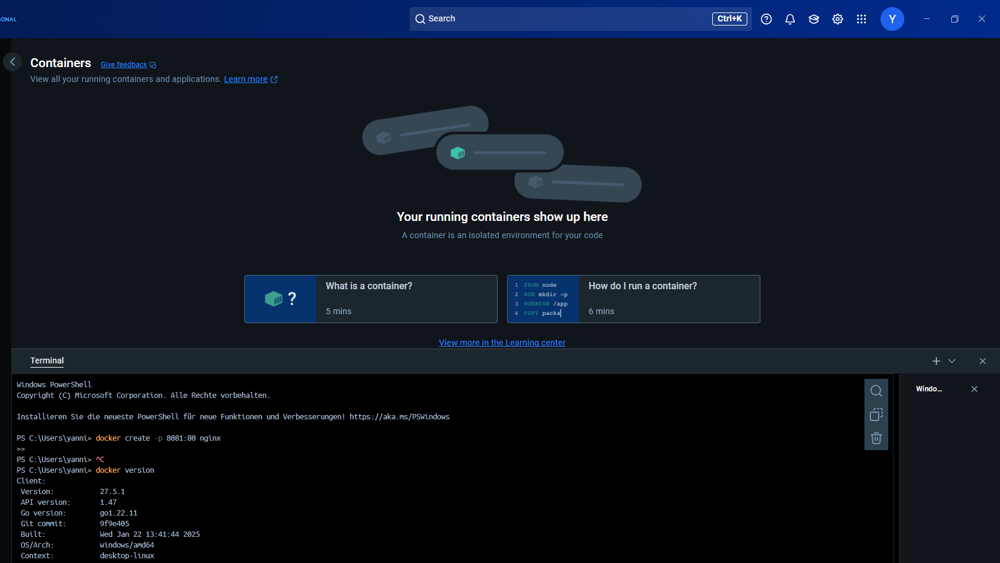
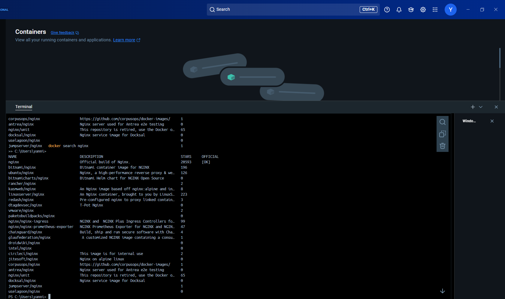
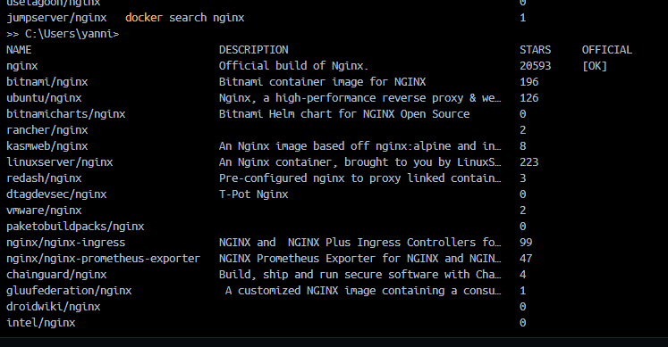
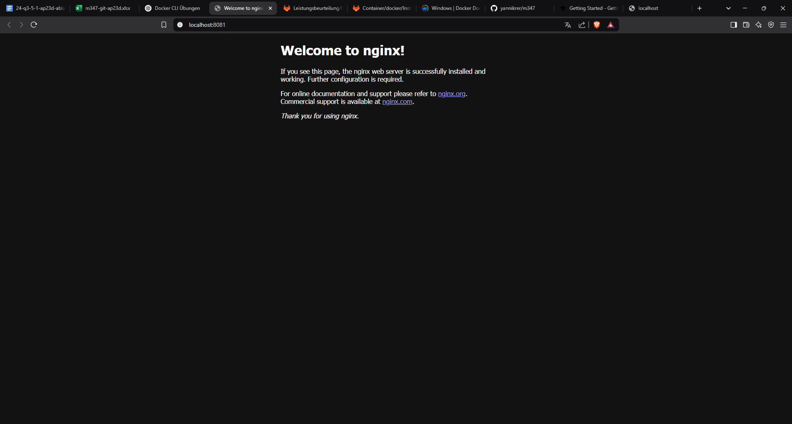
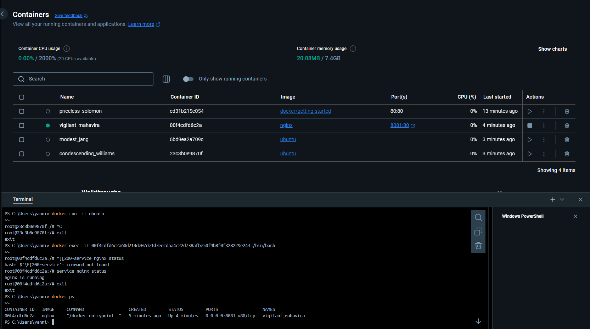
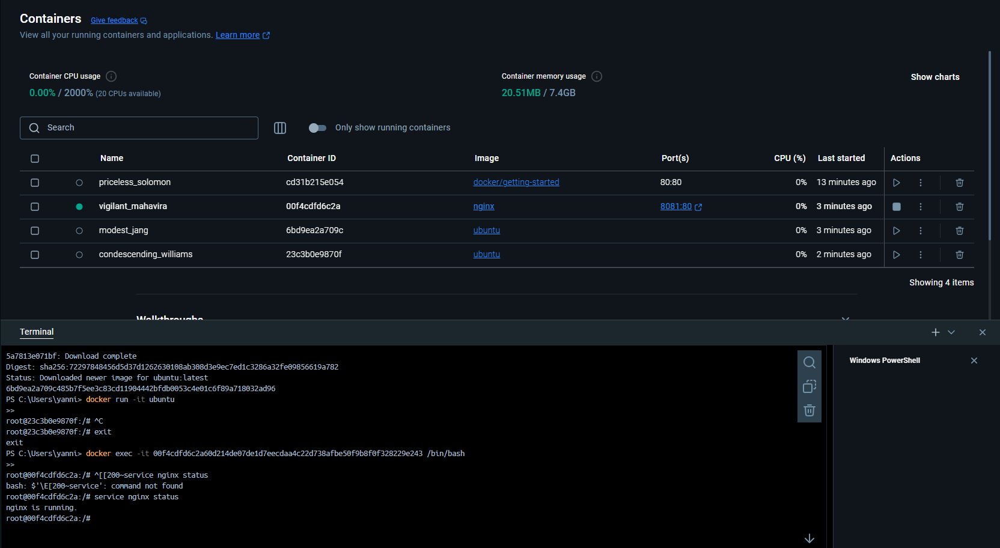

# Docker Befehle und ihre Erklärungen

## Docker Version anzeigen
```sh
docker --version
```
Zeigt die aktuell installierte Docker-Version an.

## Docker Images suchen
```sh
docker search ubuntu, docker search nginx
```
Durchsucht die Docker Hub Registry nach Images mit den Namen "ubuntu" und "nginx".

## Container im Hintergrund starten
```sh
docker run -d -p 80:80 docker/getting-started
```
Startet das Image `docker/getting-started` als Container im Hintergrund (`-d`) und mappt Port 80 des Containers auf Port 80 des Hosts.

## Image aus Docker Hub herunterladen
```sh
docker pull nginx
```
Lädt das `nginx`-Image aus Docker Hub herunter, ohne es zu starten.

## Container erstellen (ohne Starten)
```sh
docker create -p 8081:80 nginx
```
Erstellt einen Container basierend auf dem `nginx`-Image und mappt Port 8081 des Hosts auf Port 80 des Containers, startet ihn aber nicht.

## Container starten
```sh
docker start <container-id>
```
Startet einen zuvor erstellten oder gestoppten Container mit der angegebenen Container-ID.

## Container im Hintergrund starten
```sh
docker run -d ubuntu
```
Startet einen `ubuntu`-Container im Hintergrund (`-d`).

## Container im interaktiven Modus starten
```sh
docker run -it ubuntu
```
Startet einen `ubuntu`-Container im interaktiven Modus (`-it`), sodass man direkt eine Shell bekommt.

## In einen laufenden Container einsteigen
```sh
docker exec -it <container-id> /bin/bash
```
Führt eine interaktive Shell (`/bin/bash`) in einem laufenden Container aus.

## Nginx-Status im Container prüfen
```sh
service nginx status
```
Prüft den Status des Nginx-Dienstes innerhalb eines Containers. Funktioniert nur, wenn der Container eine Linux-Distribution mit `service`-Befehl nutzt.

## Laufende Container anzeigen
```sh
docker ps
```
Listet alle aktuell laufenden Container auf.

## Container stoppen
```sh
docker stop <container-id>
```
Stoppt einen laufenden Container mit der angegebenen Container-ID.

## Alle Container entfernen
```sh
docker rm $(docker ps -aq)
```
Löscht alle Container (laufende müssen vorher gestoppt werden).

## Images entfernen
```sh
docker rmi nginx ubuntu
```
Löscht die Images `nginx` und `ubuntu` von der lokalen Maschine. Funktioniert nur, wenn keine Container mehr auf diesen Images basieren.

<br><br>

# Docker CLI Screenshots Dokumentation

## 1. Docker Version Überprüfung
**Befehl:** `docker version`  
**Beschreibung:** Dieser Screenshot zeigt das Ergebnis des Befehls `docker version`. Er bestätigt, dass Docker installiert ist und zeigt die aktuelle Version des Clients und des Servers an.  



---

## 2. Docker Suche nach Ubuntu und Nginx
**Befehl:** `docker search ubuntu`  
**Beschreibung:** Der Screenshot zeigt das Ergebnis des Befehls `docker search ubuntu`. Es listet verfügbare Ubuntu-Images aus Docker Hub mit deren Beschreibung und Bewertung auf.  



**Befehl:** `docker search nginx`  
**Beschreibung:** Hier ist das Ergebnis von `docker search nginx` zu sehen. Es zeigt verschiedene Nginx-Images aus Docker Hub, darunter das offizielle `nginx`-Image.  



---

## 3. Nginx Standard-Seite im Browser
**URL:** `http://localhost:8081`  
**Beschreibung:** Dieser Screenshot zeigt die Standard-Willkommensseite von Nginx, die unter `http://localhost:8081` aufgerufen wurde. Das beweist, dass der Nginx-Container erfolgreich läuft und über den angegebenen Port erreichbar ist.  



---

## 4. Laufende und gestoppte Container anzeigen
**Befehl:** `docker ps -a`  
**Beschreibung:** Der Screenshot zeigt die Ausgabe des Befehls `docker ps -a`, welcher eine Liste aller laufenden und gestoppten Container anzeigt. Diese Liste enthält Informationen wie Container-ID, Image, Status und Ports.  



---

## 5. In den Nginx-Container wechseln und Status überprüfen
**Befehl:** `docker exec -it <container-name> /bin/bash`  
**Beschreibung:** Dieser Screenshot zeigt die Eingabe in den laufenden Nginx-Container mit dem Befehl `docker exec -it <container-name> /bin/bash`. Dadurch kann direkt auf die Container-Shell zugegriffen werden.  

**Befehl:** `service nginx status`  
**Beschreibung:** Nachdem der Container betreten wurde, zeigt dieser Screenshot das Ergebnis von `service nginx status`. Der Befehl bestätigt, ob der Nginx-Dienst im Container aktiv ist.  



---

