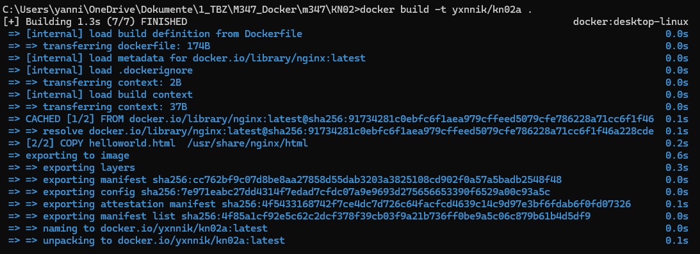
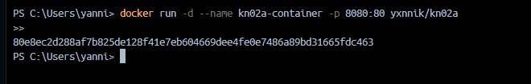
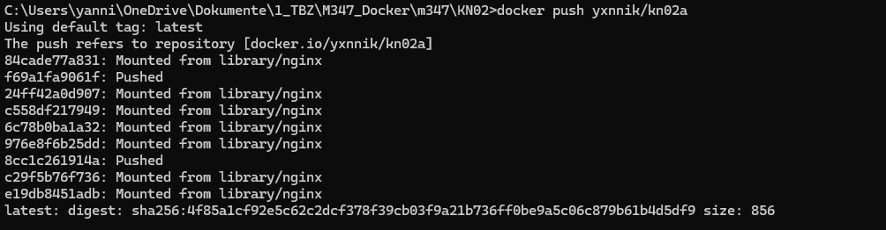
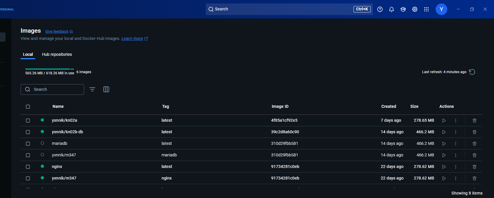
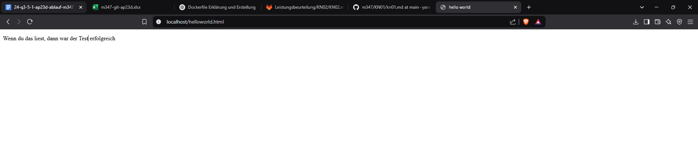
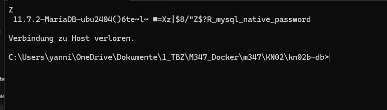
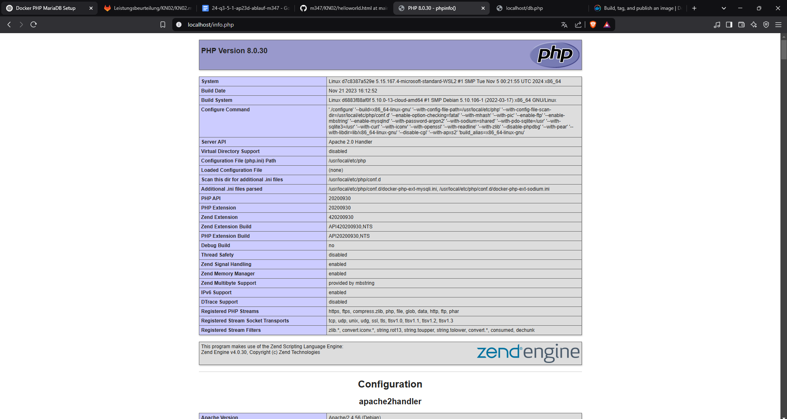
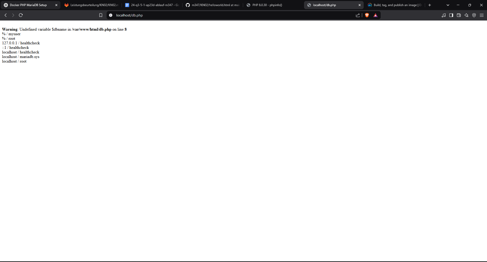

# A) Dockerfile I (Nginx mit statischer Seite)

## Dokumentiertes Dockerfile
```sh
FROM nginx  # Basis-Image ist nginx, es enthält bereits einen Webserver
COPY static-html-directory /var/www/html  # Kopiert HTML-Dateien ins Webserver-Verzeichnis
EXPOSE 80  # Öffnet Port 80, um HTTP-Anfragen zu empfangen
```

## Screenshots

### Docker build


### Docker run


### Docker push


### KN02 Image


### Laufende HTML-Seite


# B) Dockerfile II (PHP & Datenbank)

### MariaDB Connection


### Dockerfile für DB-Container
```sh
FROM mariadb:latest  
ENV MYSQL_ROOT_PASSWORD=rootpassword  
ENV MYSQL_DATABASE=mydatabase  
ENV MYSQL_USER=myuser  
ENV MYSQL_PASSWORD=mypassword  
EXPOSE 3306
```
### Buildbefehl DB-Container
```sh
docker build -t kn02b-db .
```

### Runbefehl DB-Container
```sh
docker run -d --name kn02b-db -p 3306:3306 kn02b-db
```
### info.php


### db.php


### Dockerfile für Web-Container
```sh
# PHP mit Apache verwenden
FROM php:8.0-apache  

# MySQL-Erweiterung installieren
RUN docker-php-ext-install mysqli  

# PHP-Dateien in den Apache-Ordner kopieren
COPY info.php /var/www/html/  
COPY db.php /var/www/html/  

# Port 80 für externe Verbindungen freigeben
EXPOSE 80
```

### Buildbefehl Web-Container
```sh
docker build -t kn02b-web .
```

### Runbefehl Web-Container
```sh
docker run -d --name kn02b-web --link kn02b-db -p 80:80 kn02b-web
```
### Angepasste db.php-Datei
```sh
<?php
$servername = "practical_boyd";  // WICHTIG: Name des Containers, nicht "localhost"
$username = "root";
$password = "rootpassword";
$database = "mydatabase";

// Create connection
$conn = new mysqli($servername, $username, $password, $dbname);
// Check connection
if ($conn->connect_error) {
        die("Connection failed: " . $conn->connect_error);
}

$sql = "select Host, User from mysql.user;";
$result = $conn->query($sql);
while($row = $result->fetch_assoc()){
        echo($row["Host"] . " / " . $row["User"] . "<br />");
}
//var_dump($result);
?>
```
