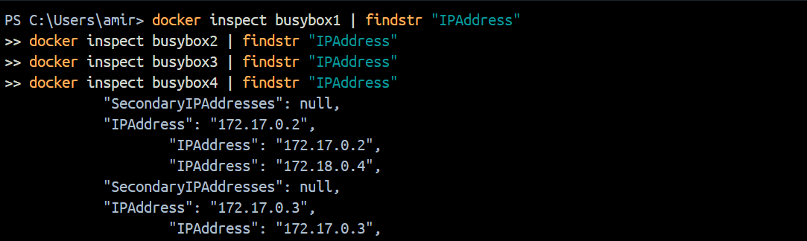
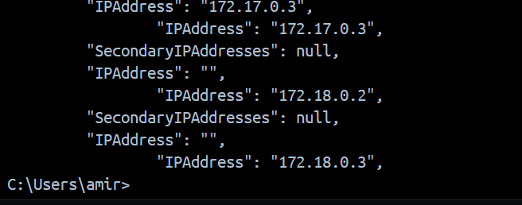

# IP Adressen von Busybox1/2/3/4


 
### Ping anzeigen
Diesen command um in die shell von busybox1 zu kommen:
```sh
docker exec -it busybox1 sh
```

 
### Befehl in der shell busybox1:
```sh
ip route
```

 
### Busybox2:
```sh
ping 172.17.0.3
```

 
 
### Busybox3:
```sh
ping busybox3
```

 
 
## Ping anzeigen 2.Teil<br>
Diesen command um in die shell von busybox3 zu kommen:
```sh
docker exec -it busybox3 sh
```

```sh
ip route
``` 

 
### Busybox1:
```sh
ping busybox1
```


### Busybox4:
```sh
ping busybox4
```

 
## KN02 Fragen
 
**In welchem Netzwerk befanden sich die beiden Container?**
In KN02 waren die Container im default bridge Netzwerk und kommunizierten über --link.
 
 
**Wieso konnten die Container in KN02 miteinander reden?**
Der --link-Parameter ermöglichte die Kommunikation über Hostnamen, ist aber veraltet