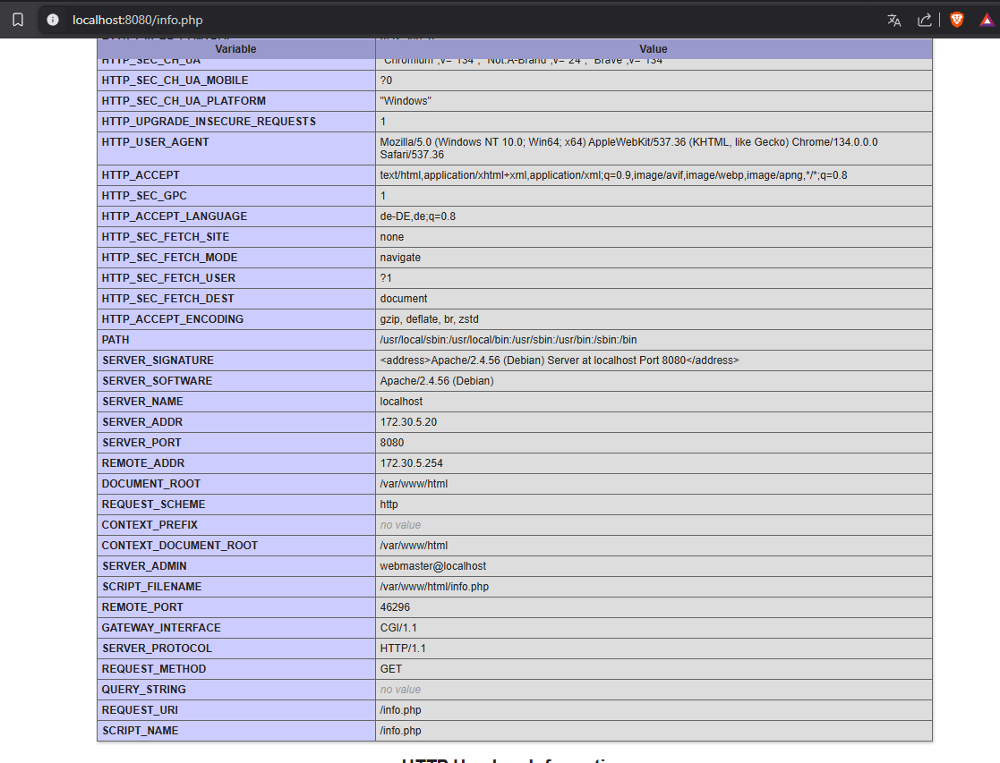
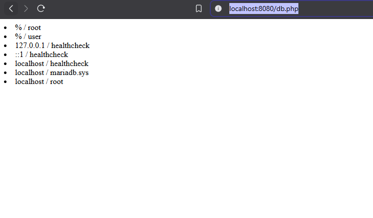
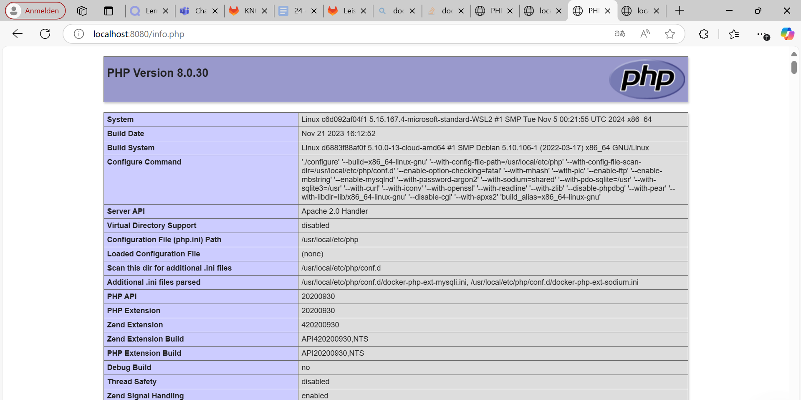
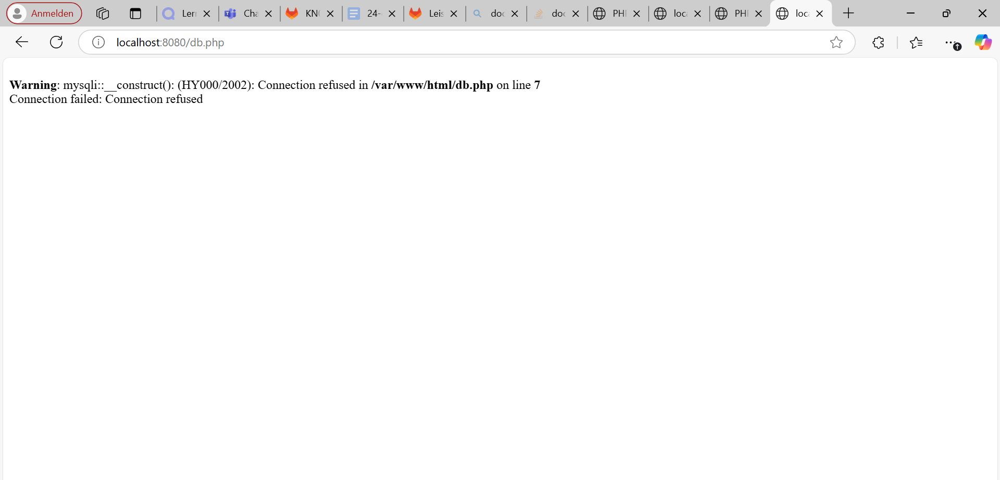

# **Docker Compose: Abgabe-Dokumentation**

## **A) Docker Compose: Lokal (60%)**

### **Teil a) Verwendung von Original Images**

#### **1. Docker Compose Datei**
In KN02 wurden zwei Container mit separaten Befehlen gestartet. In diesem Teil verwenden wir `docker-compose.yml`, um beide Container gleichzeitig mit einer YAML-Datei zu starten.

#### **2. Bedingungen der Docker Compose Datei**
- **Datenbank:** Verwendung des Images `mariadb:latest` direkt in der YAML-Datei (ohne Dockerfile).
- **Webserver:** Nutzung eines Dockerfiles für die Erstellung des Webserver-Containers.
- **Namen der Container:**  
  - `m347-kn04a-web`
  - `m347-kn04a-db`
- **Netzwerkkonfiguration:**  
  - Subnet: `172.10.0.0/16`
  - IP-Range: `172.10.5.0/24`
  - Gateway: `172.10.5.254`

---

#### **3. Dokumentation der Befehle von `docker compose up`**
Der Befehl `docker compose up` kombiniert mehrere Befehle:
1. `docker network create` – Erstellt das angegebene Netzwerk.
2. `docker volume create` – Erstellt Volumes für persistente Daten.
3. `docker pull` – Lädt die benötigten Images herunter.
4. `docker build` – Baut das Webserver-Image gemäß Dockerfile.
5. `docker create` – Erstellt, aber startet die Container nicht.
6. `docker start` – Startet die Container.
7. `docker attach` – Verbindet das Terminal mit den Container-Logs.

---

#### **4. Abgaben (Screenshots & Dateien)**
- **Screenshot:** `info.php`
  
- **Screenshot:** `db.php` 
  
- **Dateien:**  
  - `docker-compose.yml`
  - `Dockerfile` für den Webserver
  - Liste der ausgeführten Befehle

---

### **Teil b) Verwendung eigener Images**
Falls noch nicht geschehen, müssen die selbst erstellten Images aus KN02 im Repository veröffentlicht werden.

#### **1. Änderungen an der Docker Compose Datei**
- Das eigene Webserver-Image wird verwendet, daher entfällt das Dockerfile.
- Der IP-Range wird geändert.

#### **2. Abgaben & Analyse**
- **Screenshot:** `info.php` mit beiden IPs sichtbar  
  
- **Screenshot:** `db.php` (Fehlermeldung sichtbar)  
  
- **Erklärung des Fehlers:**  
  - Der Fehler tritt auf, weil sich die Datenbank-Verbindung geändert hat oder die Netzwerkeinstellungen nicht mehr passen.
  - Lösung: Anpassung der Verbindungsdetails oder Sicherstellen, dass die Datenbank im neuen Netzwerk erreichbar ist.

---

## **B) Docker Compose: Cloud (40%)**

### **1. Bereitstellung in der Cloud**
Der gleiche Prozess wird jetzt in einer Cloud-Umgebung durchgeführt.

#### **2. Anpassungen für Cloud-Init**
- **write_files:**  
  - Speichert die `docker-compose.yml` Datei auf dem Cloud-Server.
- **runcmd:**  
  - Führt `docker compose up -d` aus, um die Container zu starten.
- **SSH-Zugang für Lehrperson:**  
  - Öffentliche Schlüssel werden in die Cloud-Instanz eingefügt.

#### **3. Abgaben & Überprüfung**
- **Screenshot:** `info.php` (mit sichtbarer URL und IPs)  
  
- **Screenshot:** `db.php`  
  
- **Cloud-Init Datei** mit allen notwendigen Konfigurationen.

